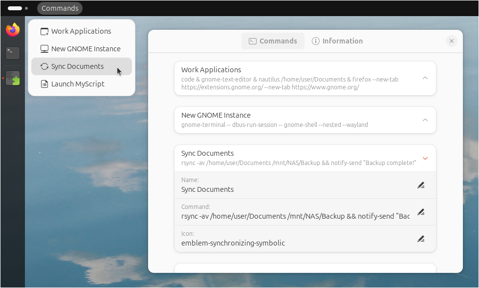
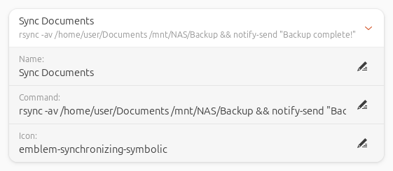

# Custom Command Menu

#### A GNOME extension to run shell commands from a drop-down menu.

Custom Command Menu is an extension for GNOME 45/46 to run user defined commands by selecting them from a drop-down menu at the top bar. 

 

 

## Features:

- Run commands by selecting them from a drop-down menu at the top bar.
- Give each command entry a custom name and icon.
- Enter commands directly into the extension preferences window without the need for configuring any external files.

 

## Installation

Browse for and install this extension through the GNOME Extension tool or install through the [GNOME Extensions website](https://extensions.gnome.org/extension/7024/custom-command-list/).

OR

Manual Installation:

1. Download the  custom-command-list.zip file of the [latest release](https://github.com/StorageB/custom-command-list/releases/tag/v1). 
2. Run the following command from the terminal:
`gnome-extensions install --force custom-command-list.zip`
3. Logout and login.

 

## Configuration

From the extension's preferences, enter the terminal/shell commands to include in the drop-down menu and the associated display name for each command. If the name field is left empty, the command will not appear in the drop-down menu.

For a list of available icons to use:
https://github.com/StorageB/icons/blob/main/Yaru/icons.md 

Alternatively, navigate to the icon directory for your system’s theme (located at /usr/share/icons), or use the [Icon Library app](https://flathub.org/apps/org.gnome.design.IconLibrary).

Enter the name of the icon (without the file extension) you want to use. Note that icon appearance will vary depending on your systems's theme.

Tips:
- Run multiple commands by using `&` between commands.
- Chain multiple commands together to run one at a time using `&&` between commands.
- Test the full command first by running it in the terminal before adding it to the extension to verify it is correct. Note that because the command is not running in a terminal window by default, there will not be any output or error messages.
- To run a command in a terminal window, use `gnome-terminal -- command`. Note that by default the GNOME terminal will close after the command is complete, but that can be changed in the terminal preferences if needed.

 

## Usage Examples and Suggestions

Here are some ideas on how this extension can be used:
- Create a command that automatically launches all the applications and web pages you need opened.
- Launch custom bash scripts or python scripts.
- Create a command to backup or sync your documents with another directory.

 

## Contributing

Contributions are welcome! Feel free to open an issue to request new features or submit a pull request to contribute to this project.

 

## License

This project is licensed under the [GNU General Public License](http://www.gnu.org/licenses/).

 

#### I hope you found this extension helpful!

